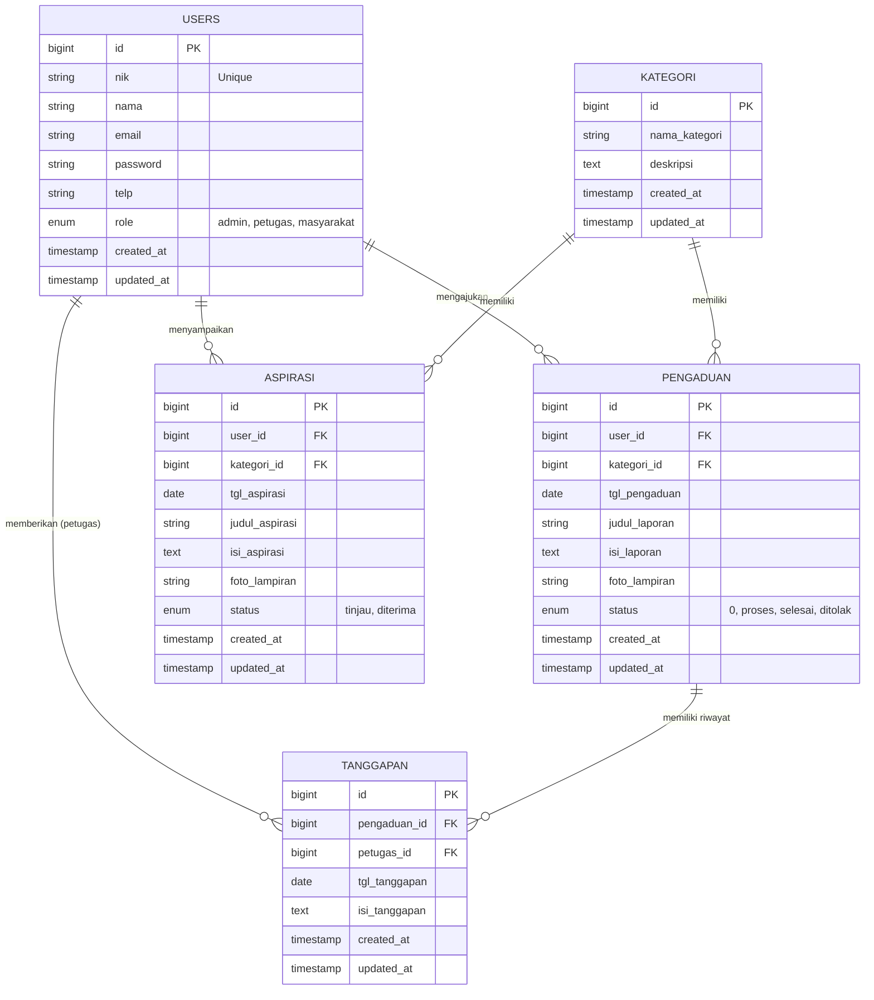

# Product Requirements Document (PRD)
## Aplikasi Sistem Informasi Pengaduan dan Aspirasi (SIPA)

---

### 1. Pendahuluan (Introduction)
**Tujuan Produk:**  
Membangun platform terpusat yang memudahkan masyarakat untuk menyampaikan keluhan, laporan masalah, serta saran (aspirasi) kepada pihak instansi atau pemerintah secara transparan, aman, dan mudah dilacak proses penyelesaiannya.

**Visi Produk:**  
Menjadi jembatan komunikasi digital yang responsif dan akuntabel antara masyarakat dan instansi demi terciptanya pelayanan publik yang lebih baik dan terukur.

---

### 2. Target Pengguna (User Personas)
1. **Masyarakat (Pelapor):** Warga yang ingin menyampaikan keluhan terkait infrastruktur, layanan, atau memberikan saran aspirasi. Mereka butuh transparansi status laporan mereka.
2. **Petugas (Verifikator/Responder):** Tim internal instansi yang bertugas memverifikasi laporan masuk, meninjau lapangan, dan memberikan tanggapan/tindak lanjut resmi di dalam sistem.
3. **Admin / Pimpinan:** Mengelola seluruh data pengguna, kategori, serta memantau statistik penyelesaian pengaduan sebagai dasar pengambilan keputusan.

---

### 3. Fitur Utama (Key Features)
1. **Autentikasi & Manajemen Akun:** Registrasi dengan validasi NIK (Nomor Induk Kependudukan), login, dan manajemen profil pengguna berdasarkan Role.
2. **Manajemen Pengaduan (Ticketing):** Form pelaporan dilengkapi dengan bukti foto, deskripsi, lokasi, dan kategori masalah. Pengguna mendapatkan nomor tiket pelacakan.
3. **Manajemen Aspirasi:** Form khusus untuk menampung ide dan saran pembangunan dari publik (tanpa harus ada tindak lanjut perbaikan instan, namun dipertimbangkan untuk kebijakan).
4. **Tracking & Notifikasi Status:** Status pengaduan (Menunggu, Diproses, Selesai, Ditolak) yang ter-update secara real-time.
5. **Tanggapan Petugas:** Fitur bagi petugas untuk membalas laporan secara langsung di thread pengaduan.
6. **Dashboard & Laporan (Reporting):** Visualisasi data (chart/grafik) jumlah laporan per kategori, laporan bulan ini, serta fitur export laporan (PDF/Excel) untuk rapat evaluasi.

---

### 4. Skema Data & Arsitektur (Data Schema & Architecture)

#### 4.1. Penjelasan Naratif (Narrative Explanation)
Sistem ini menggunakan arsitektur **Monolithic** yang dibangun di atas framework Laravel, menggunakan arsitektur MVC (Model-View-Controller) yang solid. Basis data relasional (RDBMS) dirancang untuk memisahkan entitas utama namun tetap menjaga integritas referensial.

Terdapat 5 entitas inti dalam aplikasi ini:
1. **USERS**: Tabel sentral untuk autentikasi yang mencakup Masyarakat, Petugas, dan Admin (dibedakan dengan field `role`). Data NIK digunakan sebagai identitas unik masyarakat.
2. **KATEGORI**: Tabel referensi untuk mengklasifikasikan jenis Pengaduan (misal: Infrastruktur, Pelayanan, Kebersihan) atau Aspirasi agar mudah difilter dan dilaporkan.
3. **PENGADUAN**: Tabel transaksional utama yang merekam keluhan masyarakat. Menyimpan detail keluhan, lampiran (foto), serta memiliki status pelacakan. Terhubung dengan `users` (sebagai pelapor) dan `kategori`.
4. **TANGGAPAN**: Menyimpan rekam jejak balasan atau tindakan dari petugas terhadap suatu pengaduan. Relasi One-to-Many dari Pengaduan ke Tanggapan.
5. **ASPIRASI**: Serupa dengan pengaduan namun memiliki alur (flow) yang lebih sederhana karena bersifat saran/ide dari masyarakat, tidak selalu menuntut penyelesaian layaknya keluhan.

#### 4.2. Visualisasi ERD (Mermaid Diagram)
Berikut adalah Entity Relationship Diagram yang memetakan hubungan antar tabel database di atas:

---

### 5. Spesifikasi Teknis (Technical Specifications)
*   **Backend Framework:** PHP 8.2+, Laravel 11
*   **Frontend & UI:** Blade Template Engine terintegrasi dengan Bootstrap 5 (menggunakan template NiceAdmin)
*   **Database:** MySQL / SQLite
*   **Authentication & Security:** Built-in Laravel Auth, CSRF Protection, Password Hashing (Bcrypt).
*   **Storage:** Local Storage (untuk bukti lampiran pelaporan).

---
*Dokumen ini disusun sebagai panduan dasar pengembangan Sistem Informasi Pengaduan dan Aspirasi untuk memastikan seluruh stakeholder memiliki pemahaman yang sama terhadap tujuan dan arsitektur produk.*
